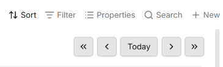
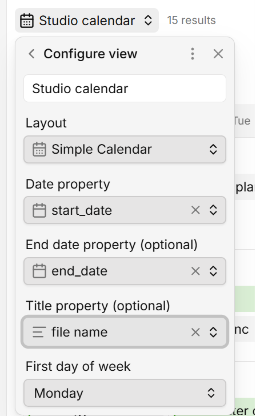
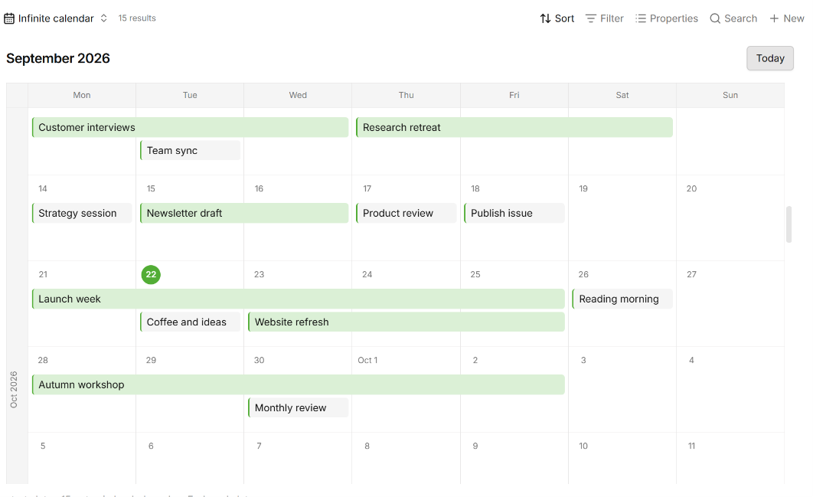
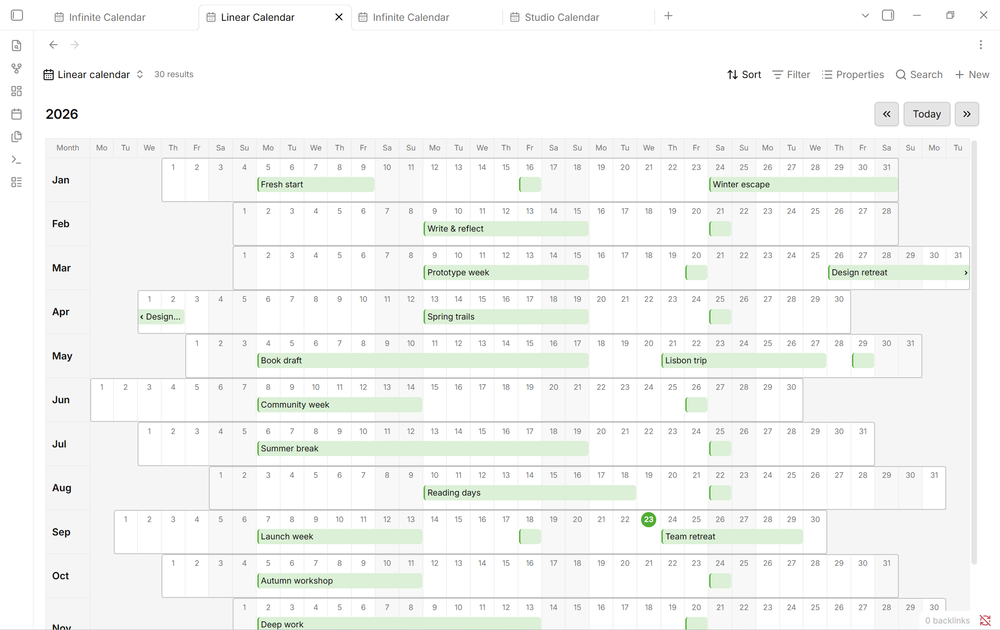

# Just Simple Calendar

**The purpose is to make a calendar as lightweight and simple as possible, with no external libraries and no dependency on other community plugins.** That is why Just Simple Calendar exists: a small, focused way to see your notes on a calendar, using the features already built into Obsidian.

It adds **three calendar view types to Bases**. Your notes remain ordinary Markdown files, your dates remain ordinary properties, and your Base keeps control of filtering and sorting. There is no separate event database, calendar framework, React runtime, account, or remote service.


## Small by design

- Monthly calendar with **Previous year**, **Previous month**, **Today**, **Next month**, and **Next year**.
- A second **Infinite Calendar** view: scroll up into the past or down into the future through a continuous stream of weeks.
- A **Linear Calendar** view: a whole year with one month per row and aligned weekdays.
- A selectable start date and an optional, inclusive end date.
- An optional title property instead of the file name, with automatic fallback for missing or blank values.
- An optional color property: eight native color names or a custom hex color.
- Continuous bars for multi-day notes, with a continuation marker when they cross a week.
- Separate lanes for overlapping notes.
- Native hover previews and double-click to open.
- Right-click actions to open, open in a new tab, open to the right, or delete.
- Create a blank note from an empty day with its date already filled in.
- Monday or Sunday week start, keyboard support, and styling that follows your theme.

The JavaScript is less than **25 KB uncompressed**. The plugin has **zero runtime package dependencies**; only Obsidian's own API is external to the bundle. Development tools are not shipped with the plugin.

## Install

Requires **Obsidian 1.10.2 or later**, with the built-in **Bases** feature enabled. Enable the built-in **Page preview** feature if you want hover previews. These are Obsidian core features, not additional community plugins.

1. Open **Settings → Community plugins → Browse** in Obsidian.
2. Search for **Just Simple Calendar**.
3. Select **Install**, then **Enable**.

## Set up a calendar

1. Create or open a Base.
2. Open its view settings and choose **Simple Calendar** for a month, **Infinite Calendar** for continuous weeks, or **Linear Calendar** for a year.
3. Set **Date property** to your start date property, such as `start_date`.
4. Optionally set **End date property (optional)** to `end_date`.
5. Optionally set **Title property (optional)** to the property you want to display, such as `title`.
6. Optionally set **Color property (optional)** to a text property such as `color`.
7. Choose **First day of week**: Monday or Sunday.

Each view saves its own settings inside the `.base` file. You can use different date properties in different views of the same notes.

Use the double-arrow buttons **«** and **»** to jump backward or forward one year while keeping the same month. The single arrows move one month, and **Today** returns to the current month. Thanks to [u/anchovybird](https://www.reddit.com/user/anchovybird/) for suggesting faster navigation to previous years.



The title property changes only the label shown on the calendar, including multi-day bars. Notes keep their file names, and previews and opening actions still target the original note. Leave the selector unset to use file names; missing, empty, or whitespace-only values also fall back to the file name. Thanks to [u/Nyrazoth](https://www.reddit.com/user/Nyrazoth/) for suggesting custom calendar titles.




A note can be as simple as:

```yaml
---
start_date: 2026-09-21
end_date: 2026-09-25
---
```

Property names are your choice. There are no required folders, tags, templates, or naming conventions.

## Event colors

In any of the three views, select **Color property (optional)** and choose a text property such as `color`. The property name is up to you; each view saves its own selection.

Use one of Obsidian's eight palette names: `red`, `orange`, `yellow`, `green`, `cyan`, `blue`, `purple`, or `pink`. Names are case-insensitive and use your theme's palette, including its light and dark variants.

```yaml
---
start_date: 2026-09-21
end_date: 2026-09-25
color: blue
---
```

For a custom color, use three or six hexadecimal digits, for example `color: "#F80"` or `color: "#E57373"`. **Quote hex values in YAML** so the `#` is not treated as a comment.

The chosen color is used for the border and a soft background tint; text keeps the theme's normal text color. Hovering slightly strengthens the tint. Colors apply to every segment of a multi-day note and to single-day notes, including the text-free blocks in Linear Calendar.

Leave the selector unset to keep the existing appearance. Missing, blank, invalid, or non-text values also use the default appearance. Other CSS color formats and alpha hex values are not supported. The calendar only reads this property; it does not rewrite notes or add a color to newly created notes.

## Multi-day notes

The start and end days are **both included**. September 21 through September 25 occupies five days and appears as one continuous bar. A range crossing a week has one segment per calendar row, with arrows indicating continuation. The title appears once per segment.

- No end property selected, or no end value on a note: one day.
- End date equals the start: one day.
- End date is invalid or earlier than the start: the note stays on its start day, with an explanatory count below the calendar.
- Invalid or missing start date: the note is counted below the calendar but is not placed on a day.

Month totals count **distinct notes**, not the number of occupied days. Ranges are clipped to the visible weeks, so a long-running note does not generate off-screen calendar cells.

## Infinite Calendar



Choose **Infinite Calendar** as a second Bases view type when you want to focus on weeks rather than separate months. Scroll upward into the past or downward into the future. Weekday headings stay visible; month/year markers appear in the left margin, and the first day of each month includes its abbreviated month name. **Today** returns to the current week.

It uses the same date and title properties, week-start setting, previews, and note actions as Simple Calendar. Weeks continue across month and year boundaries without duplicating days. Multi-day notes remain continuous within each week.

Only a bounded window of weeks is rendered. As that window moves, the visible week and its position are preserved, including when weeks have different heights. The footer counts distinct notes in the loaded weeks, not the entire Base.

Thanks to [u/DudPug](https://www.reddit.com/user/DudPug/) for suggesting a continuous, scrollable calendar focused on weeks.

## Linear Calendar



Choose **Linear Calendar** for a yearly overview with one month per row. Each month starts under its correct weekday, so weekends align vertically. Use **Previous year**, **Today**, and **Next year** to navigate. Monday and Sunday week starts are supported.

Multi-day notes form continuous bars across a month, with continuation markers when they cross into another month or year. Overlapping notes occupy separate lanes; busy months grow to fit them. Date and title properties, hover previews, and all note actions work just like the other views. Single-day notes appear as colored blocks without visible text; hover to read the title or preview the note. Their full titles remain available to screen readers. Multi-day bars keep their labels.

Each month's days have a slightly stronger outline so the twelve horizontal month bars are easy to distinguish. The weekday header and month labels stay visible while scrolling. Narrow panes scroll horizontally to keep dates readable. This view omits the footer and bottom padding to give the calendar as much room as possible.

Thanks to [u/Quirky_Departure_409](https://www.reddit.com/user/Quirky_Departure_409/) for suggesting a yearly linear view, and to Nick Milo for explaining this approach in his [Linear Calendar video](https://www.youtube.com/watch?v=SQHYj7x-t3A): seeing the whole year helps you spot busy periods and make room for what matters.

## Open, preview, and manage notes

Hover anywhere on a note or bar to preview it on desktop. By default no Ctrl/Cmd key is needed; this can be changed in **Settings → Page preview → Just Simple Calendar**.

Double-click opens the note in the current pane. On mobile, tap once. A right-click on the note offers the actions below:


### Keep the calendar beside your note

Choose **Open to the right** to open a note beside the calendar. The calendar reuses the pane it created while that pane remains open, so browsing several notes does not keep splitting the workspace.


### Create a note on a day

Double-click empty space inside a day, or right-click it and choose **Create note on YYYY-MM-DD**. Bases creates a blank note and opens its native editor so you can give it a name and start writing.

The selected start date property is already filled in. The folder, unique filename, and other filter-derived properties follow Bases' own creation behavior. A new note may still be excluded by a restrictive filter; the plugin does not override your Base's filters.


Creation requires a writable note property. File creation/modification dates and formula results can be displayed, but cannot be assigned by the calendar.

### Delete a note

Right-click a note and choose **Delete note**. This deletes the underlying note file using Obsidian's configured deletion preference: system trash, vault trash, or permanent deletion. The calendar updates automatically.

### Keyboard controls

| Focus | Key | Action |
| --- | --- | --- |
| Note or bar | Enter or Space | Open in the current pane |
| Note or bar | Shift+F10 | Open its context menu |
| Day | Enter | Create a dated note |
| Day | Shift+F10 | Open the day's context menu |

All screenshots are real captures from Obsidian. The visual theme is not bundled or required; the calendar follows your own theme and accent color.

## Scope and behavior

These are date-based views. They intentionally leave out hourly scheduling, drag-to-reschedule, recurrence rules, notifications, and external calendar synchronization.

Bases supplies the filtered, sorted results. Notes are assigned to the first available lane in that order. Grouping does not produce separate calendars. Weeks grow to fit their notes; the calendar scrolls vertically.

ISO date strings (`YYYY-MM-DD`) and ISO datetime strings are supported. String datetimes use their written calendar day; typed Bases dates use Bases' date-only value. The plugin's interface is in English. Your note titles, property names, and view names are preserved exactly as you write them.

The plugin uses web and Obsidian APIs compatible with desktop and mobile. Physical-device testing is documented separately from desktop mobile emulation in the [validation notes](docs/VALIDATION.md).

## Privacy and dependencies

- No network requests, telemetry, analytics, ads, account, or paid features.
- No external services and no access to files outside the vault.
- No community plugin dependencies and no bundled calendar or UI framework.
- No custom note format, background synchronization, or self-updater.
- Viewing and opening notes does not rewrite them. Creating and deleting notes are explicit actions.

This is an independent plugin, not an official Obsidian product.

## License

[MIT](LICENSE). Copyright 2026 David Hurtado.
