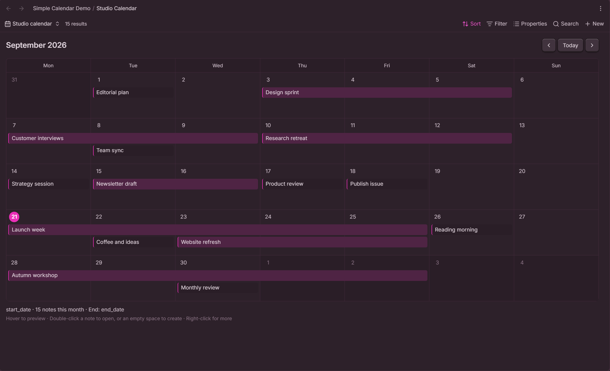
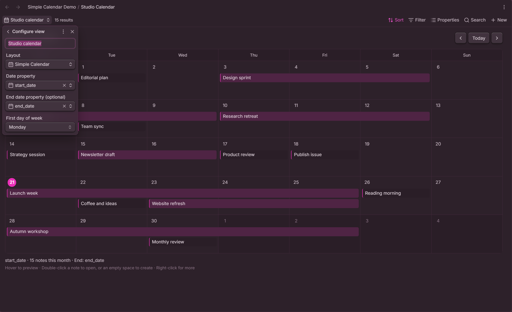
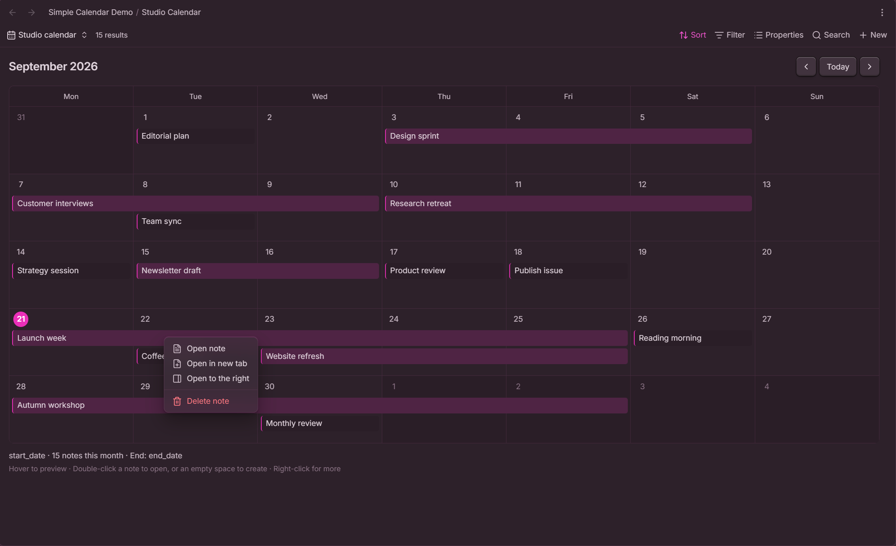
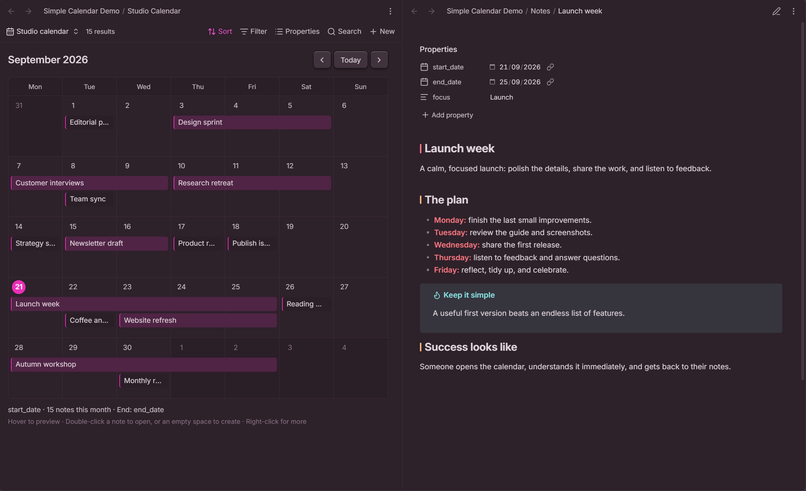
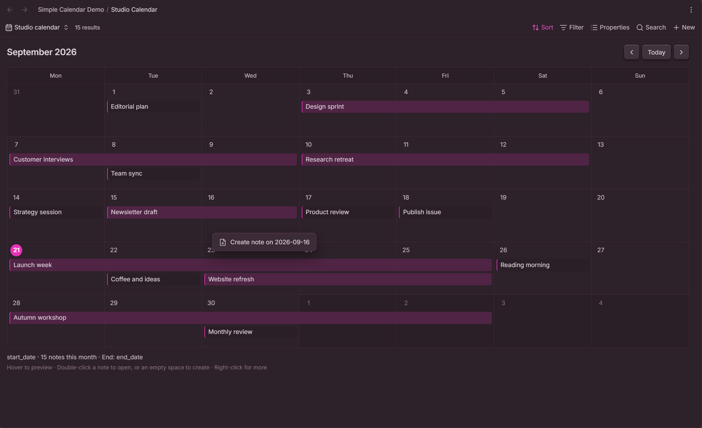

# Just Simple Calendar

**The purpose is to make a calendar as lightweight and simple as possible, with no external libraries and no dependency on other community plugins.** That is why Just Simple Calendar exists: a small, focused way to see your notes on a calendar, using the features already built into Obsidian.

It adds a **new view type to Bases**. Your notes remain ordinary Markdown files, your dates remain ordinary properties, and your Base keeps control of filtering and sorting. There is no separate event database, calendar framework, React runtime, account, or remote service.



## Small by design

- Monthly calendar with **Previous month**, **Today**, and **Next month**.
- A selectable start date and an optional, inclusive end date.
- Continuous bars for multi-day notes, with a continuation marker when they cross a week.
- Separate lanes for overlapping notes.
- Native hover previews and double-click to open.
- Right-click actions to open, open in a new tab, open to the right, or delete.
- Create a blank note from an empty day with its date already filled in.
- Monday or Sunday week start, keyboard support, and styling that follows your theme.

The JavaScript is approximately **11 KB uncompressed**. The plugin has **zero runtime package dependencies**; only Obsidian's own API is external to the bundle. Development tools are not shipped with the plugin.

## Install

Requires **Obsidian 1.10.2 or later**, with the built-in **Bases** feature enabled. Enable the built-in **Page preview** feature if you want hover previews. These are Obsidian core features, not additional community plugins.

### Manual installation

1. Download `main.js`, `manifest.json`, and `styles.css` from the [latest release](https://github.com/DavidHurtadoAI/just-simple-calendar/releases/latest).
2. Create the folder `<your-vault>/.obsidian/plugins/just-simple-calendar/`.
3. Place the three downloaded files directly in that folder.
4. Reload Obsidian, then enable **Just Simple Calendar** under **Settings → Community plugins**.

If you use a custom configuration folder, substitute that folder for `.obsidian`.

### Optional: install through BRAT

If you already use BRAT, add `DavidHurtadoAI/just-simple-calendar` as a beta plugin. BRAT is an optional installer; it is not required to run this plugin.

The GitHub release is available immediately. Availability in Obsidian's Community plugins browser depends on the separate directory review process.

## Set up a calendar

1. Create or open a Base.
2. Open its view settings and choose **Simple Calendar** as the layout.
3. Set **Date property** to your start date property, such as `start_date`.
4. Optionally set **End date property (optional)** to `end_date`.
5. Choose **First day of week**: Monday or Sunday.

Each view saves its own settings inside the `.base` file. You can use different date properties in different views of the same notes.



A note can be as simple as:

```yaml
---
start_date: 2026-09-21
end_date: 2026-09-25
---
```

Property names are your choice. There are no required folders, tags, templates, or naming conventions.

## Multi-day notes

The start and end days are **both included**. September 21 through September 25 occupies five days and appears as one continuous bar. A range crossing a week has one segment per calendar row, with arrows indicating continuation. The title appears once per segment.

- No end property selected, or no end value on a note: one day.
- End date equals the start: one day.
- End date is invalid or earlier than the start: the note stays on its start day, with an explanatory count below the calendar.
- Invalid or missing start date: the note is counted below the calendar but is not placed on a day.

Month totals count **distinct notes**, not the number of occupied days. Ranges are clipped to the visible weeks, so a long-running note does not generate off-screen calendar cells.

## Open, preview, and manage notes

Hover anywhere on a note or bar to preview it on desktop. By default no Ctrl/Cmd key is needed; this can be changed in **Settings → Page preview → Just Simple Calendar**.

Double-click opens the note in the current pane. On mobile, tap once. A right-click on the note offers the actions below:



### Keep the calendar beside your note

Choose **Open to the right** to open a note beside the calendar. The calendar reuses the pane it created while that pane remains open, so browsing several notes does not keep splitting the workspace.



### Create a note on a day

Double-click empty space inside a day, or right-click it and choose **Create note on YYYY-MM-DD**. Bases creates a blank note and opens its native editor so you can give it a name and start writing.

The selected start date property is already filled in. The folder, unique filename, and other filter-derived properties follow Bases' own creation behavior. A new note may still be excluded by a restrictive filter; the plugin does not override your Base's filters.



Creation requires a writable note property. File creation/modification dates and formula results can be displayed, but cannot be assigned by the calendar.

### Delete a note

Right-click a note and choose **Delete note**. This deletes the underlying note file using Obsidian's configured deletion preference: system trash, vault trash, or permanent deletion. The calendar updates automatically.

### Keyboard controls

| Focus | Key | Action |
| --- | --- | --- |
| Note or bar | Enter or Space | Open in the current pane |
| Note or bar | Shift+F10 | Open its context menu |
| Day | Enter | Create a dated note |
| Day | Shift+F10 | Open the day's context menu |

## Try the example calendar

The screenshots show the included [fictional demo](examples/README.md). Copy it into a test vault and navigate to **September 2026** to explore a full month of single-day notes, overlapping projects, and a workshop crossing into October.

All screenshots are real captures from Obsidian. The visual theme is not bundled or required; the calendar follows your own theme and accent color.

## Scope and behavior

This is a monthly, date-based view. It intentionally leaves out hourly scheduling, drag-to-reschedule, recurrence rules, notifications, and external calendar synchronization.

Bases supplies the filtered, sorted results. Notes are assigned to the first available lane in that order. Grouping does not produce separate calendars. Weeks grow to fit their notes; the calendar scrolls vertically.

ISO date strings (`YYYY-MM-DD`) and ISO datetime strings are supported. String datetimes use their written calendar day; typed Bases dates use Bases' date-only value. The plugin's interface is in English. Your note titles, property names, and view names are preserved exactly as you write them.

The plugin uses web and Obsidian APIs compatible with desktop and mobile. Physical-device testing is documented separately from desktop mobile emulation in the [validation notes](docs/VALIDATION.md).

## Privacy and dependencies

- No network requests, telemetry, analytics, ads, account, or paid features.
- No external services and no access to files outside the vault.
- No community plugin dependencies and no bundled calendar or UI framework.
- No custom note format, background synchronization, or self-updater.
- Viewing and opening notes does not rewrite them. Creating and deleting notes are explicit actions.

This is an independent plugin, not an official Obsidian product.

## Verify release provenance

Starting with **1.0.1**, tagged releases are built, tested, and published by GitHub Actions. All three installable files have [GitHub artifact attestations](https://docs.github.com/en/actions/how-tos/secure-your-work/use-artifact-attestations/use-artifact-attestations) linking their hashes to the source repository and build workflow.

With the GitHub CLI installed and authenticated, download a release and verify its files:

```sh
gh release download 1.0.1 --repo DavidHurtadoAI/just-simple-calendar --dir calendar-release
gh attestation verify calendar-release/main.js --repo DavidHurtadoAI/just-simple-calendar --signer-workflow DavidHurtadoAI/just-simple-calendar/.github/workflows/release.yml
gh attestation verify calendar-release/styles.css --repo DavidHurtadoAI/just-simple-calendar --signer-workflow DavidHurtadoAI/just-simple-calendar/.github/workflows/release.yml
gh attestation verify calendar-release/manifest.json --repo DavidHurtadoAI/just-simple-calendar --signer-workflow DavidHurtadoAI/just-simple-calendar/.github/workflows/release.yml
```

Attestations verify provenance and file integrity; they are not a guarantee that software is bug-free. This verification is optional and adds no runtime dependency to the plugin.

## Development

Use Node.js 22.13 or later.

```sh
npm ci
npm run check
```

The checks run the official Obsidian ESLint rules, TypeScript, calendar/layout tests, a production build, and release validation. The release audit checks version alignment, screenshot links, runtime imports, and the project's 25 KiB JavaScript size budget.

The three installable files are `main.js`, `manifest.json`, and `styles.css`. See the [release checklist](docs/RELEASE-CHECKLIST.md) and [changelog](CHANGELOG.md) for details.

## License

[MIT](LICENSE). Copyright 2026 David Hurtado.
